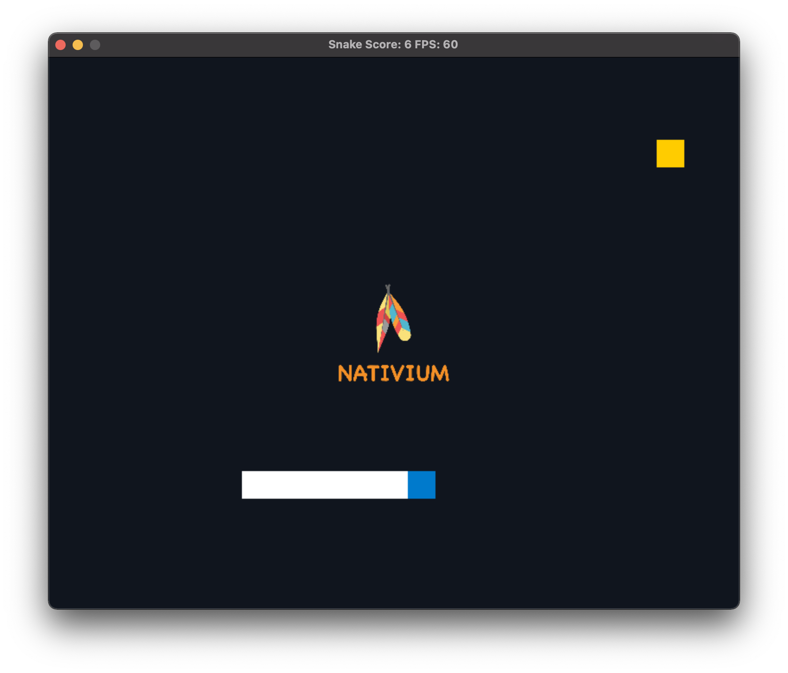

# Nativium - Game

<p align="center">
    <a href="https://github.com/nativium/nativium-game" target="_blank" rel="noopener noreferrer">
        
    </a>
</p>

<br>

<p align="center">
    <a href="https://github.com/nativium/nativium-game/actions/workflows/linux.yml"></a>
    <a href="https://github.com/nativium/nativium-game/actions/workflows/macos.yml"></a>
    <a href="https://github.com/nativium/nativium-game/actions/workflows/windows.yml"></a>
    <a href="https://github.com/nativium/nativium-game/actions/workflows/ios.yml"></a>
    <a href="https://github.com/nativium/nativium-game/actions/workflows/android.yml"></a>
    <a href="https://github.com/nativium/nativium-game/actions/workflows/wasm.yml"></a>
</p>

<br>

<p align="center">This is a sample about how to use Nativium architecture with custom install to build a game.</p>

<br>

# General

First of all you need to do the steps of the original [Nativium](https://github.com/nativium/nativium) project.

Visit:

https://github.com/nativium/nativium

# Build for Linux

Execute the following commands to build for Linux:

```
git clone https://github.com/nativium/nativium.git nativium
cd nativium
python nativium.py custom install --path=../custom
python nativium.py target linux prepare
python nativium.py target linux build
python nativium.py target linux run
```

# Build for macOS

Execute the following commands to build for macOS:

```
git clone https://github.com/nativium/nativium.git nativium
cd nativium
python nativium.py custom install --path=../custom
python nativium.py target macos prepare
python nativium.py target macos build
python nativium.py target macos run
```

# Build for Windows

Execute the following commands to build for Windows:

```
git clone https://github.com/nativium/nativium.git nativium
cd nativium
python nativium.py custom install --path=../custom
python nativium.py target windows prepare
python nativium.py target windows build
python nativium.py target windows run
```

Obs: On Windows the terminal needs to be opened as `administrator`, otherwise the `symlinks` will not be created.

# Build for WASM

Execute the following commands to build for Web Assembly (WASM):

```
git clone https://github.com/nativium/nativium.git nativium
cd nativium
python nativium.py custom install --path=../custom
python nativium.py target wasm prepare
python nativium.py target wasm build
python nativium.py target wasm serve
```

# Build for iOS

Execute the following commands to build for iOS:

```
git clone https://github.com/nativium/nativium.git nativium
cd nativium
python nativium.py custom install --path=../custom
python nativium.py target ios prepare
python nativium.py target ios build
python nativium.py target ios package --no-framework
python nativium.py target ios dist generate
python nativium.py app ios-pods
```

Open the project for Xcode:

```
open apps/ios/runner/Runner.xcworkspace
```

# Build for Android

Execute the following commands to build for Android:

```
git clone https://github.com/nativium/nativium.git nativium
cd nativium
python nativium.py custom install --path=../custom
python nativium.py target android prepare
python nativium.py target android build
python nativium.py target android package
python nativium.py target android dist generate
```

Open the project for Android Studio:

```
apps/android/runner
```

# Web Assembly Demo

Visit:

[https://nativium-game.s3.amazonaws.com/demo/1.0.0/index.html](https://nativium-game.s3.amazonaws.com/demo/1.0.0/index.html)
